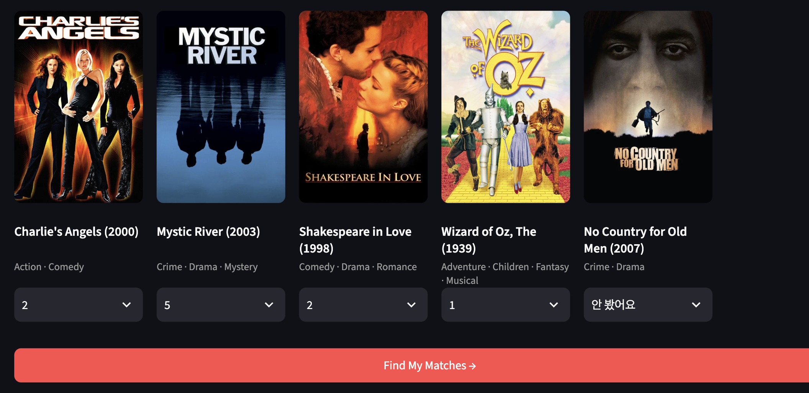
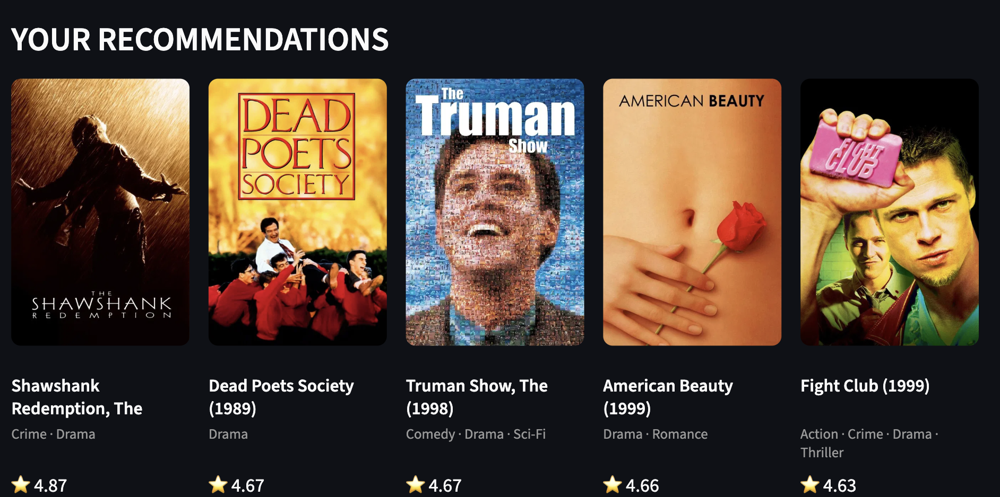
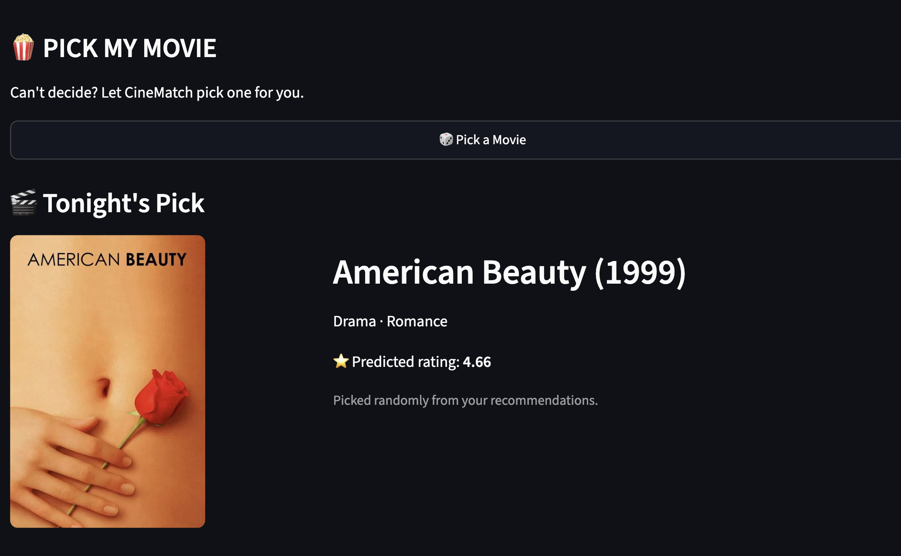

# 🎬 CineMatch

> **Discover your next favorite movie based on your taste.**

CineMatch는 사용자가 몇 편의 영화를 평가하면, **MovieLens의 기존 사용자 중 취향이 가장 비슷한 사용자를 찾아 그들의 평점을 기반으로 영화를 추천하는 개인화 영화 추천 시스템**이야.

단순히 영화의 평균 평점을 보여주는 것이 아니라,
**새로운 사용자의 평점 → 유사 사용자 탐색 → 유사 사용자의 선호 영화 분석 → 예상 평점 계산 → 추천**의 과정을 거쳐 개인화된 추천 결과를 제공해.

## 📸 Demo




### How it works

1. 영화 10편에 대한 평점을 입력
2. 기존 사용자들과의 **Cosine Similarity** 계산
3. 가장 유사한 사용자 **Top-K** 선택
4. 유사 사용자들이 높은 평점을 준 영화 중 후보 선정
5. 유사도를 가중치로 사용해 **예상 평점(Predicted Rating)** 계산
6. 예상 평점이 높은 영화 **Top 10** 추천

---

## ✨ Key Features

* 🎯 **Personalized Recommendation**

  * 사용자의 영화 평가를 기반으로 개인화된 추천 제공

* 👥 **New User Recommendation**

  * 기존 사용자 데이터만으로 새로운 사용자의 취향과 유사한 사용자를 탐색

* 📐 **Cosine Similarity**

  * 사용자가 공통으로 평가한 영화들의 평점을 이용해 사용자 간 유사도 계산

* ⭐ **Weighted Rating Prediction**

  * 유사 사용자의 평점에 유사도를 가중치로 적용해 영화별 예상 평점 계산

* 🖼️ **TMDB Poster Integration**

  * TMDB API를 활용해 추천 영화의 포스터를 표시

* 📱 **Streamlit Web UI**

  * 영화 선택부터 추천 결과까지 웹 인터페이스에서 바로 확인

---

## 🧠 Recommendation Algorithm

### 1. User Profile

사용자가 처음 제시된 영화 중 본 영화에 평점을 입력하면 새로운 사용자 프로필을 생성해.

평점을 입력하지 않은 영화는 분석에서 제외하고, 실제로 평가한 영화만 사용자의 취향을 나타내는 데이터로 사용해.

### 2. Find Similar Users

새로운 사용자가 평가한 영화와 기존 사용자가 평가한 영화 중 **공통 영화가 최소 3개 이상인 사용자**만 대상으로 유사도를 계산해.

그리고 공통으로 평가한 영화들의 평점 벡터에 **Cosine Similarity**를 적용해 사용자 간 유사도를 구해.

```text
New User
   │
   ├── Movie A → 5
   ├── Movie B → 4
   └── Movie C → 2
          │
          ▼
  Existing Users
          │
          ▼
   Cosine Similarity
          │
          ▼
   Top-K Similar Users
```

### 3. Candidate Movies

선택된 유사 사용자들이 **3.5점 이상** 평가한 영화만 추천 후보로 사용해.

또한 유사 사용자 중 **최소 3명이 평가한 영화**만 후보로 남겨 특정 사용자 한 명의 평가에 지나치게 의존하지 않도록 했어.

이미 새로운 사용자가 평가한 영화는 추천 후보에서 제외해.

### 4. Predicted Rating

각 영화에 대해 유사 사용자의 평점을 유사도로 가중하여 예상 평점을 계산해.

$$
PredictedRating =
\frac{\sum(rating_i \times similarity_i)}
{\sum similarity_i}
$$

즉, **나와 더 비슷한 사용자의 평점에 더 큰 영향력**을 주는 방식이야.

예상 평점이 높은 순으로 정렬한 뒤 최종적으로 Top 10 영화를 추천해.

---

## 📊 Dataset

CineMatch는 **MovieLens ml-latest-small** 데이터셋을 사용했어.

| Data    |    Size |
| ------- | ------: |
| Users   |     610 |
| Movies  |   9,742 |
| Ratings | 100,836 |
| Tags    |   3,683 |

평점은 **0.5점 단위의 0.5 ~ 5.0점**으로 구성되어 있어.

데이터는 MovieLens에서 제공하는 공개 데이터셋을 사용했어.

**Dataset:** MovieLens ml-latest-small
**Source:** GroupLens Research, University of Minnesota

---

## 🛠️ Tech Stack

* **Python**
* **Pandas** - 데이터 처리 및 전처리
* **NumPy** - 수치 연산
* **Scikit-learn** - Cosine Similarity 및 데이터 분할
* **Streamlit** - 웹 애플리케이션
* **TMDB API** - 영화 포스터 데이터
* **python-dotenv** - API Token 관리

---

## 📁 Project Structure

```text
CineMatch/
│
├── app.py
│
├── src/
│   ├── preprocessing.py
│   ├── user.py
│   ├── similarity.py
│   ├── recommend.py
│   └── tmdb.py
│
├── data/
│   ├── movies.csv
│   ├── ratings.csv
│   ├── tags.csv
│   └── links.csv
│
├── evaluation.py
├── README.md
└── .env
```

### Main Modules

**`preprocessing.py`**

* MovieLens 데이터 로드
* User-Movie Rating Matrix 생성
* Cosine Similarity 계산을 위한 결측값 처리

**`user.py`**

* 초기 영화 10편 선택
* 새로운 사용자 프로필 생성

**`similarity.py`**

* 기존 사용자 간 Cosine Similarity 계산
* 새로운 사용자와 기존 사용자 간 유사도 계산
* Top-K 유사 사용자 탐색

**`recommend.py`**

* 유사 사용자 평점 추출
* 추천 후보 영화 생성
* 유사도 기반 예상 평점 계산
* 최종 추천 영화 생성

**`tmdb.py`**

* TMDB API를 이용한 영화 포스터 조회
* API 호출 결과 캐싱

**`evaluation.py`**

* Train/Test 데이터 분할
* Precision@K 기반 추천 성능 평가

---

## 🔍 Evaluation

추천 시스템의 성능을 확인하기 위해 데이터를 사용자별로 **Train/Test Set으로 분리**하고, 추천 결과와 실제 사용자가 높은 평점을 준 영화를 비교하는 **Precision@K**를 사용했어.

```text
MovieLens Ratings
       │
       ▼
 Train / Test Split
       │
       ├── Train → Recommendation System
       │
       └── Test  → Actual Movies
                       │
                       ▼
                  Precision@K
```

이를 통해 모델이 단순히 영화를 추천하는 것에서 끝나는 게 아니라, **사용자가 실제로 선호한 영화와 얼마나 겹치는지** 확인할 수 있도록 구성했어.

---

## 💡 What I Learned

이 프로젝트를 통해 단순한 데이터 분석을 넘어 **추천 시스템의 전체적인 흐름**을 직접 구현했어.

특히 다음 과정을 경험했어.

* User-Movie Matrix를 이용한 사용자 기반 협업 필터링
* Cosine Similarity를 이용한 사용자 유사도 계산
* Cold Start 상황의 새로운 사용자 추천
* Similarity-weighted rating prediction
* 추천 후보 필터링 및 Top-K Recommendation
* Precision@K를 이용한 추천 성능 평가
* 외부 API를 활용한 실제 서비스 형태의 데이터 연결
* Streamlit을 이용한 데이터 기반 웹 애플리케이션 구현

---

## 🚀 Run Locally

### 1. Clone Repository

```bash
git clone https://github.com/your-username/CineMatch.git
cd CineMatch
```

### 2. Install Dependencies

```bash
pip install -r requirements.txt
```

### 3. Set TMDB API Token

프로젝트 루트에 `.env` 파일을 생성하고 TMDB API Token을 추가해.

```env
TMDB_API_TOKEN=your_token_here
```

### 4. Run Streamlit

```bash
streamlit run app.py
```

브라우저에서 CineMatch를 실행하면 영화 평점을 입력하고 개인화된 추천 결과를 확인할 수 있어.

---

## 📌 Future Improvements

현재 시스템은 **사용자 기반 협업 필터링(User-Based Collaborative Filtering)**을 중심으로 구현되어 있어.

향후 다음과 같은 방향으로 확장할 수 있어.

* Item-Based Collaborative Filtering 추가
* Matrix Factorization / SVD 기반 추천 비교
* 추천 알고리즘별 성능 비교
* Precision@K 외 Recall@K, RMSE 등 평가 지표 추가
* 더 많은 사용자 입력을 통한 추천 정확도 향상
* 추천 결과에 영화 설명 및 상세 정보 추가

---

## 📚 References

* MovieLens Dataset
  GroupLens Research, University of Minnesota

* Harper, F. Maxwell and Konstan, Joseph A.
  *The MovieLens Datasets: History and Context.*
  ACM Transactions on Interactive Intelligent Systems, 2015.

---

## 👤 Project

**CineMatch**
Personalized Movie Recommendation System
